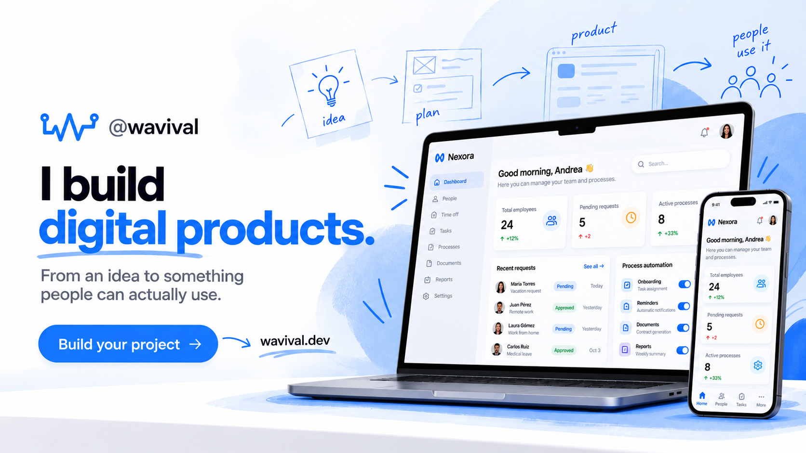

<h1 align="left">
  
  Valentina Ramírez · Portfolio v4
</h1>



[](https://www.wavival.dev)
[](https://blog.luminaw.co/)
[](https://luminaw.co/)

> Version 4 of the personal portfolio for Valentina Ramírez, backend developer focused on application security and founder of [Lúmina W](https://luminaw.co/). It is a bilingual Astro site, deployed on Vercel, with a serverless quote-delivery function.

## Contents

- [Local development](#local-development)
  - [Requirements](#requirements)
  - [Environment variables](#environment-variables)
  - [Commands](#commands)
- [Stack](#stack)
- [Architecture](#architecture)
  - [Project structure](#project-structure)
- [Routes and internationalization](#routes-and-internationalization)
  - [Locale routes](#locale-routes)
  - [Microfrontends](#microfrontends)
- [Design system](#design-system)
  - [Principles](#principles)
- [SEO, discovery and accessibility](#seo-discovery-and-accessibility)
  - [SEO and discovery](#seo-and-discovery)
  - [Accessibility](#accessibility)
- [Testing and quality](#testing-and-quality)
  - [Local validation](#local-validation)
  - [CI gates](#ci-gates)
- [Delivery flow](#delivery-flow)
  - [Branch model](#branch-model)
- [Deployment](#deployment)
  - [Vercel](#vercel)
- [Repository documentation](#repository-documentation)
- [License](#license)
- [Contact](#contact)

## Local development

### Requirements

- Node `22.x`, pinned in [`.nvmrc`](./.nvmrc)
- npm

```bash
git clone git@github.com:wavival/wavival.dev.git
cd wavival.dev
nvm use
npm ci
cp .env.example .env
npm run dev
```

The development server runs at `http://localhost:4321`.

### Environment variables

The Umami values are optional. Analytics and Core Web Vitals reporting are emitted only when both are set. `BREVO_API_KEY` is required in Vercel for quote delivery and must remain server-only.

| Variable           | Read by                  | Required                               | Purpose                                                      |
| ------------------ | ------------------------ | -------------------------------------- | ------------------------------------------------------------ |
| `PUBLIC_UMAMI_SRC` | Build (`Layout.astro`)   | Optional, both Umami variables or none | Umami script URL.                                            |
| `PUBLIC_UMAMI_ID`  | Build (`Layout.astro`)   | Optional, both Umami variables or none | Umami website ID.                                            |
| `BREVO_API_KEY`    | Runtime (`api/quote.ts`) | Required in Vercel for quotes          | Brevo transactional email key. Server-only, never `PUBLIC_`. |

Set the three variables in the Vercel project settings, not in the repository. The `PUBLIC_` ones are read at build time, so a change needs a new deployment. `wavival.dev@luminaw.co` must be a verified sender in Brevo. See [`.env.example`](./.env.example) for the local template.

### Commands

| Command                | Purpose                                                         |
| ---------------------- | --------------------------------------------------------------- |
| `npm run dev`          | Starts Astro with HMR on port 4321.                             |
| `npm run build`        | Builds the static site into `dist/`.                            |
| `npm run preview`      | Serves the production build locally.                            |
| `npm run check`        | Runs Astro diagnostics and type checks.                         |
| `npm run lint`         | Runs ESLint.                                                    |
| `npm run lint:fix`     | Runs ESLint and applies the safe fixes.                         |
| `npm run format`       | Formats the repository with Prettier.                           |
| `npm run format:check` | Checks Prettier formatting.                                     |
| `npm test`             | Runs Playwright against a production preview on port 4329.      |
| `npm run test:ui`      | Opens the Playwright UI runner.                                 |
| `npm run test:install` | Installs the Chromium build Playwright needs.                   |
| `npm run commitlint`   | Checks a commit message against the Conventional Commits rules. |
| `npm run lhci`         | Runs Lighthouse CI against `dist/`. Build first.                |
| `npm run links`        | Checks built links in `dist/`. Build first.                     |
| `npm run csp:check`    | Validates CSP hashes after a build.                             |
| `npm run css:check`    | Ensures component CSS classes survive the production build.     |

## Stack

| Layer                | Choice                                                                 |
| -------------------- | ---------------------------------------------------------------------- |
| Framework            | Astro 7, static pages plus one Vercel Function for quote delivery.     |
| Styling              | Tailwind CSS 3, PostCSS, CSS custom properties.                        |
| Components           | Astro, organized with atomic design.                                   |
| Client scripts       | Vanilla TypeScript.                                                    |
| Internationalization | Spanish at root and English under `/en/`.                              |
| SEO                  | `@astrojs/sitemap`, Open Graph, Twitter Card, JSON-LD and `llms.txt`.  |
| Analytics            | Umami and `web-vitals`, enabled only with both public Umami variables. |
| Testing              | Playwright, Lighthouse CI, linkinator, ESLint and Prettier.            |
| Hosting              | Vercel with Microfrontends.                                            |

## Architecture

The site is statically rendered with Astro 7. Tailwind CSS 3 supplies utility classes while CSS custom properties carry the design tokens. Client behavior is limited to vanilla TypeScript for navigation, theme state, quote submission, and optional web-vitals reporting. The Vercel Function at `api/quote.ts` sends quote requests through Brevo to `wavival.dev@luminaw.co`.

### Project structure

```text
src/
├── components/          atoms, molecules and organisms
├── pages/cotizar.astro  Spanish quote page; English mirror lives in pages/en/quote/
├── data/                projects, stack, GitHub build-time data and view models
├── i18n/                copy, slug map, localized routes and accessibility helpers
├── layouts/             Layout.astro, the shared document shell and metadata owner
├── pages/               Spanish routes and the English mirror
├── scripts/             navigation, theme and optional RUM behavior
├── utils/               pure helpers (bento grid spans)
└── styles/              global CSS, design tokens and component classes

api/                     quote.ts, the only Vercel Function
public/                  brand, fonts, UI icons, images, CVs, crawler and AI-discovery files
scripts/                 build-time validation scripts
tests/                   Playwright browser and unit-style specs
docs/                    brand, commercial, release and roadmap documentation
.github/workflows/       CI, PR checks, auto-merge into dev, branch cleanup and release
assets/                  README-only visual assets
```

`Layout.astro` owns the shared head, canonical URL, hreflang tags, Open Graph and Twitter metadata, JSON-LD, theme pre-paint logic, navigation loader, navigation, footer, and skip link. Project content is defined in `src/data/projects.ts`; `projectView.ts` adapts it for localized rendering.

## Routes and internationalization

Spanish is the default locale at the root. English is mirrored below `/en/`.

### Locale routes

| Spanish          | English         |
| ---------------- | --------------- |
| `/`              | `/en/`          |
| `/proyectos/`    | `/en/projects/` |
| `/servicios/`    | `/en/services/` |
| `/cotizar/`      | `/en/quote/`    |
| `/sobre-mi/`     | `/en/about/`    |
| `/contacto/`     | `/en/contact/`  |
| `/herramientas/` | `/en/uses/`     |
| `/privacidad/`   | `/en/privacy/`  |

Case studies live at `/proyectos/[slug]/` and `/en/projects/[slug]/`. `src/i18n/utils.ts` is the source of truth for language pairs, localized routes, alternate URLs, active navigation, and CV links. Update its slug map whenever a page or slug changes.

### Microfrontends

The Vercel Microfrontends contract reserves `/nullbreach` and `/nullbreach/:path*` for the independent NullBreach project. This portfolio owns all remaining paths.

## Design system

### Principles

Version 4 uses the @wavival | Design System v4:

- One-column editorial composition at the full container width.
- Raleway 800 for display typography and Poppins for body copy.
- One accessible blue signal for interactive elements.
- 1px rules instead of shadowed cards.
- Static content with native `<details>` disclosures, no scroll-reveal behavior.
- Atomic components in `src/components/atoms`, `molecules`, and `organisms`.
- Dark theme by default, controlled with the `.dark` class and persisted in `localStorage`.

Tokens live in `src/styles/tokens.css`; component classes live in `src/styles/utilities.css`. Use the token names and complete literal component class names to preserve Tailwind output.

## SEO, discovery and accessibility

### SEO and discovery

Full detail: [`docs/seo.md`](./docs/seo.md) and [`docs/i18n.md`](./docs/i18n.md).

Every route receives a shared metadata baseline from `Layout.astro`:

- Canonical URLs and reciprocal `es`, `en`, and `x-default` hreflang alternates.
- Locale-specific default Open Graph cards: `og-card-es.webp` and `og-card-en.webp`, both 1200x630 WebP. Case studies use their own cards.
- Open Graph, Twitter Card, structured data, sitemap, and robots metadata.
- `Person`, `Organization`, and `WebSite` JSON-LD on all pages, plus page-specific structured data where applicable.
- `public/llms.txt` and `public/llms-full.txt` for AI discovery.
- Umami and Core Web Vitals reporting only when `PUBLIC_UMAMI_SRC` and `PUBLIC_UMAMI_ID` are both configured.

### Accessibility

Full detail: [`docs/accessibility.md`](./docs/accessibility.md), [`docs/performance.md`](./docs/performance.md) and [`docs/security.md`](./docs/security.md).

Accessibility behavior includes a visible skip link, localized state labels, a keyboard-safe mobile menu, native disclosures, 44px icon control targets, explicit image dimensions, and a single visible `<h1>` per route. The automated suite checks desktop and mobile rendering, routes, SEO, i18n, theme behavior, project filters, and design regressions.

## Testing and quality

### Local validation

Run the complete browser suite after building:

```bash
npm run build
npm test
```

### CI gates

The CI workflow also runs the dependency audit (`scripts/check-audit.mjs`, which accepts only the advisories it lists with a reason), formatting, linting, Astro checks, the production build, CSP hash validation, component CSS validation, Lighthouse, and internal-link checks. Pull requests additionally validate commit messages, titles, secrets, and the allowed base branch.

## Delivery flow

### Branch model

```text
feature/*, fix/*, chore/*  ->  dev  ->  stg  ->  main
```

- `main` is production, `stg` is staging, and `dev` is the integration branch.
- Work branches target `dev` through pull requests.
- Promotions are only `dev` to `stg` and `stg` to `main`, always with merge commits. `stg` to `main` is merged only by the owner. Because each promotion merge commit lands only on the base branch, a direct head can show as behind; the only allowed alternative head is a branch whose tree is identical to `dev` (or `stg`), which keeps the base-branch check passing.
- `auto-merge-dev.yml` enables auto-merge on every non-draft PR into `dev` from a `feature/`, `fix/` or `chore/` branch, and the merge waits for the required checks.
- `delete-merged-branches.yml` deletes, every 12 hours or on demand with `dry_run`, the branches of PRs merged into `dev`.
- `release.yml` is run by hand to tag and publish a version, see [`docs/RELEASING.md`](./docs/RELEASING.md).
- Conventional Commit messages follow `type(scope): message`.
- Automated checks include commit title and message validation, quality, Playwright, Lighthouse, internal links, Gitleaks, and pull-request base validation.
- Vercel configuration, redirects, security headers, and cache policies live in [`vercel.json`](./vercel.json).

## Deployment

### Vercel

Vercel builds the project with `npm run build`, installs dependencies with `npm ci`, serves `dist/`, and deploys `api/quote.ts` as the quote-delivery function. Set `BREVO_API_KEY` in Vercel and verify `wavival.dev@luminaw.co` as a Brevo sender. The site is available at `https://www.wavival.dev`.

`microfrontends.json` defines the Vercel development and path-ownership contract. `vercel.json` defines redirects, immutable asset caches, and production security headers. When editing inline scripts, run `npm run build && npm run csp:check` and update the CSP hash only when required by the check.

## Repository documentation

| Document                                                                   | Scope                                                                                                  |
| -------------------------------------------------------------------------- | ------------------------------------------------------------------------------------------------------ |
| [README.md](./README.md)                                                   | Repository overview, local setup, architecture, delivery and documentation map.                        |
| [AGENTS.md](./AGENTS.md)                                                   | Operational rules for agents: scope, documentation sources, delivery flow and verification.            |
| [DESIGN.md](./DESIGN.md)                                                   | @wavival Design System v4 tokens, type scale, component classes, composition, and accessibility rules. |
| [COMPONENTS.md](./COMPONENTS.md)                                           | Component and layout contracts, props, and usage details.                                              |
| [CHANGELOG.md](./CHANGELOG.md)                                             | Versioned project history following Keep a Changelog and SemVer.                                       |
| [docs/seo.md](./docs/seo.md)                                               | SEO, indexing, structured data and AI-assistant discovery (GEO).                                       |
| [docs/i18n.md](./docs/i18n.md)                                             | Spanish and English: page map, copy locations and rules.                                               |
| [docs/accessibility.md](./docs/accessibility.md)                           | Accessibility guarantees, component behavior, checks and checklist.                                    |
| [docs/performance.md](./docs/performance.md)                               | Performance decisions, caching, measuring and checklist.                                               |
| [docs/security.md](./docs/security.md)                                     | Headers, CSP, the quote function, data, supply chain and checklist.                                    |
| [docs/engineering.md](./docs/engineering.md)                               | Engineering practices: branches, commits, code, checks, CI and documentation.                          |
| [docs/RELEASING.md](./docs/RELEASING.md)                                   | How a version is chosen, tagged and released with the `Release` workflow.                              |
| [docs/brand.md](./docs/brand.md)                                           | Living personal-brand positioning, voice, visual rules, product relationship, and content boundaries.  |
| [docs/commercial.md](./docs/commercial.md)                                 | Living commercial offer, ideal client, permitted claims, CTAs, and content risks.                      |
| [docs/ROADMAP.md](./docs/ROADMAP.md)                                       | Pending work, decisions that need the owner, and known gaps.                                           |
| [public/cv_valentina_ramirez_es.pdf](./public/cv_valentina_ramirez_es.pdf) | Spanish downloadable CV.                                                                               |
| [public/cv_valentina_ramirez_en.pdf](./public/cv_valentina_ramirez_en.pdf) | English downloadable CV.                                                                               |
| [public/llms.txt](./public/llms.txt)                                       | Public AI-discovery index.                                                                             |
| [public/llms-full.txt](./public/llms-full.txt)                             | Public long-form AI-discovery companion.                                                               |
| [public/robots.txt](./public/robots.txt)                                   | Public crawler directives and sitemap location.                                                        |
| [public/.well-known/security.txt](./public/.well-known/security.txt)       | Public RFC 9116 security contact.                                                                      |
| [SECURITY.md](./SECURITY.md)                                               | Private vulnerability-reporting policy for the repository and deployed site.                           |
| [.env.example](./.env.example)                                             | Local environment-variable template.                                                                   |
| [LICENSE](./LICENSE)                                                       | MIT license.                                                                                           |

## License

MIT. See [LICENSE](./LICENSE).

## Contact

 **Valentina Ramírez · @wavival**

> Thanks for getting here. Let's build great things.

[](https://www.linkedin.com/in/wavival)
[](https://www.instagram.com/wavival)
[](mailto:wavival.dev@luminaw.co)
